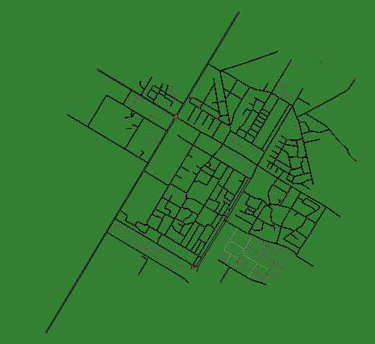
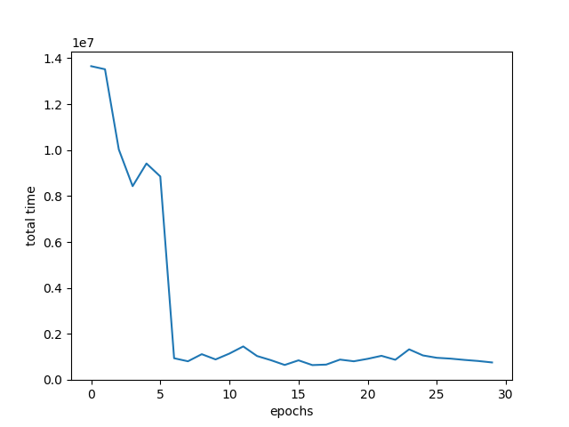
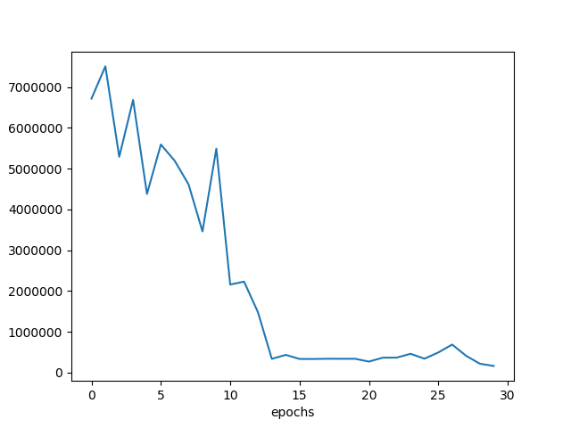

# Traffic-light-management-system
This repository contains files for traffic light management system using Reinforcement Learning.

## Basic Idea 

suppose we have a city grid as shown above with 4 traffic light nodes. 
n1, n2 , n3 and n4

Our model makes 4 decisions (one for each node)  for which side to select for green signal 

we have to select a minimum time (for ex 30s) our model can not select green light time below that limit.

Out task is to minimize amount of time vehicles have to wait on the traffic signal. 
Amount of waiting time for given traffic signal is equal to total car present on the signal x number of seconds 
each traffic signal will have 4 waiting time counter for each side of road. So based on that our model will 
decide which side to select for green signal.

## Basic training process.

We trained our model on some number of events. 
Event is defined as a fixed motion where vehicles will pass through node in a fixes (pseudo-random manner). 
reason for keeping event fixed is that using random event everytime will give random result. 
we will use many such fixed events to train our model so our model could handle different situations.

only input our model will receie is number of vehicles present on 4 sides of each traffic node. 
and out model will output 4 sides one for each node and amount of time for each node.

number of nodes depends on size of the grid.

## SUMO for siumlation

We used SUMO open source software to make maps and generate simulation to train our model.

Here are the examples of some of the maps used to train the model.

### Map1 

### Map2

### Map 3

###  Epoch Vs Time for Map1

### Epoch Vs Time for Map2

### Epoch Vs Time for Map3

## How to train new Networks.

First Download or clone the repository. 
Then pip install requirements.txt using

`pip install -r requirements.txt`

you need to download SUMO GUI for running simulations.

download sumo gui from [here](https://sumo.dlr.de/docs/Downloads.php)

### Step1: create newtork and route file

Use SUMO netedit tool to create a network 
for example 'network.net.xml' and save it in maps folder.

cd into maps folder and run following command

`python randomTrips.py -n network.net.xml -r routes.rou.xml -e 500`

This will create routes.rou.xml file for 500 simulation steps for the network "network.net.xml"

### Step2: Set Configuration file.

You need to provide network and route files to Configuration file. 
change net-file and route-files in input.

`<input>`        
  `<net-file value='maps/city1.net.xml'/>`
  `<route-files value='maps/city1.rou.xml'/>`
`</input>`

### Step3: Train the model.

Now use train.py file to train model for this network. 

`python train.py --train -e 50 -m model_name`

This code will train the model for 50 epoch. 
-e is to set the epochs. 
-m for model_name which will be saved in models folder. 
--train tells the train.py to train the model if not specified it will load model_name from the models folder.

At the end of simulation it will show time_vs_epoch graphs and save it to plots folder with name time_vs_epoch_{model_name}.png

### Step4: Running trained model.

You can use train.py to run pretrained model on gui.

`python train.py -m model_name`

This will open gui which you can run to see how your model performs.

 

