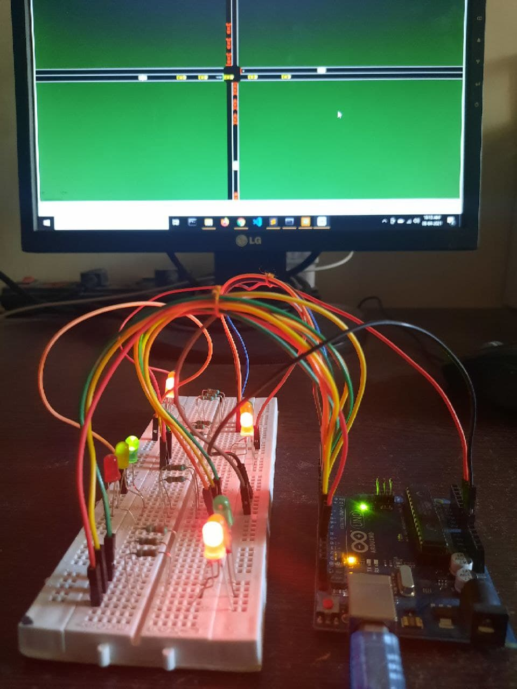
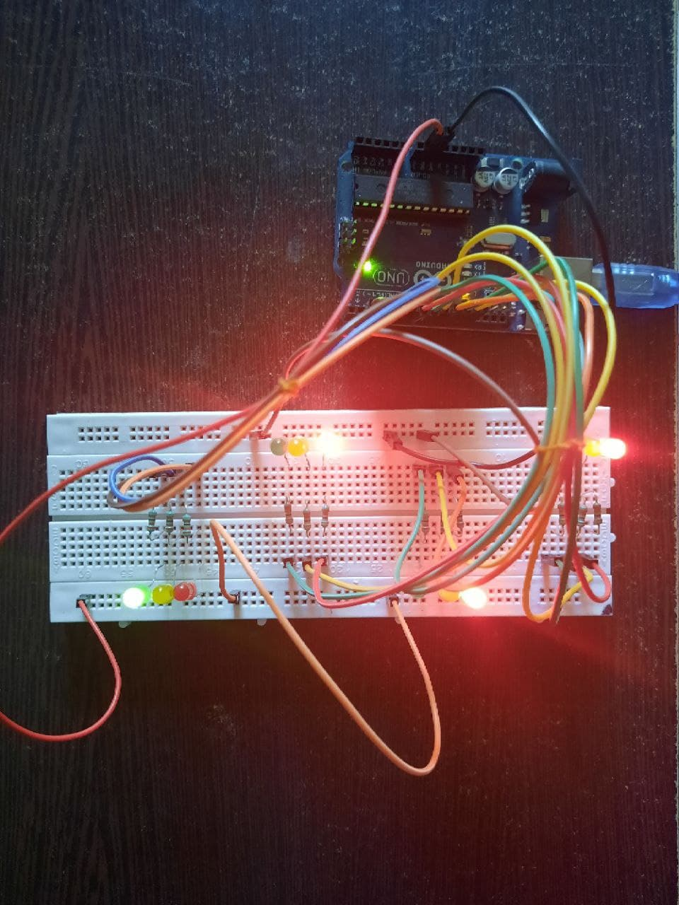
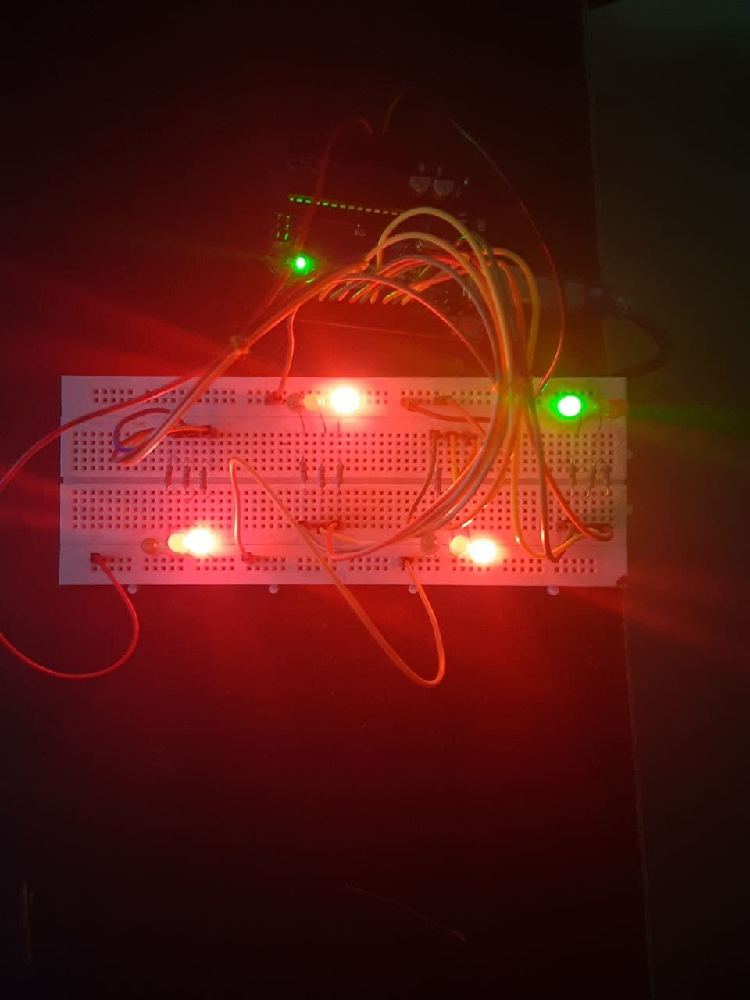

# Dynamic-Traffic-light-management-system
This repository contains files for the traffic light management system using Reinforcement Learning.

## Basic Idea 

Suppose we have a city grid as shown above with 4 traffic light nodes. 
n1, n2, n3, and n4

So, our model makes 4 decisions (one for each node) for which side to select for the green signal 

we have to select a minimum time (for ex 30s) that our model can not select a green light time below that limit.

Our task is to minimize the amount of time vehicles have to wait on the traffic signal. 
The amount of waiting time for a given traffic signal is equal to the total car present on the signal x number of seconds. 
Each traffic signal will have 4 waiting time counter for each side of the road. So based on that our model will 
decide which side to select for the green signal.

## Basic training process.

We have trained our model on a number of events. 
Event is defined as a fixed motion where vehicles will pass through nodes in a fixed (pseudo-random manner). 
The reason for keeping the event fixed is that using a random event every time will give a random result. 
we will use many such fixed events to train our model so our model can handle different situations.

The only input our model will receive is the number of vehicles present on 4 sides of each traffic node. 
and our model will output 4 sides one for each node.

The number of nodes depends on the size of the grid.

## SUMO for siumlation

We used SUMO open-source software to make maps and generate simulations to train our model.

Here are examples of some of the maps used to train the model.

### Map1 

### Map2

### Map 3

###  Epoch Vs Time for Map1

### Epoch Vs Time for Map2

### Epoch Vs Time for Map3

## Simulation of Trained Model.

https://user-images.githubusercontent.com/44360315/113673665-e8edd300-96d6-11eb-8fbe-d09e078fbfbe.mp4

## Arduino connection.

We have connected our simulation with Arduino. 

### Arduino1

### Arduino2

### Arduino3

## How to train new Networks.

First Download or clone the repository. 
Then pip install requirements.txt using

`pip install -r requirements.txt`

you need to download SUMO GUI for running simulations.

download sumo gui from [here](https://sumo.dlr.de/docs/Downloads.php)

### Step1: create network and route file

Use SUMO netedit tool to create a network 
for example 'network.net.xml' and save it in the maps folder.

cd into maps folder and run the following command

`python randomTrips.py -n network.net.xml -r routes.rou.xml -e 500`

This will create a routes.rou.xml file for 500 simulation steps for the network "network.net.xml"

### Step2: Set Configuration file.

You need to provide network and route files to the Configuration file. 
change net-file and route-files in input.

`<input>`        
  `<net-file value='maps/city1.net.xml'/>`
  `<route-files value='maps/city1.rou.xml'/>`
`</input>`

### Step3: Train the model.

Now use the train.py file to train a model for this network. 

`python train.py --train -e 50 -m model_name -s 500`

This code will train the model for 50 epochs. 
-e is to set the epochs. 
-m for model_name which will be saved in the model folder. 
-s tells simulation to run for 500 steps. 
--train tells the train.py to train the model if not specified it will load model_name from the model's folder.

At the end of the simulation, it will show time_vs_epoch graphs and save them to plots folder with name time_vs_epoch_{model_name}.png

### Step4: Running trained model.

You can use train.py to run a pre-trained model on GUI.

`python train.py -m model_name -s 500` 

This will open GUI which you can run to see how your model performs.
To get accurate results set a value of -s the same for testing and training.

### Extra: Running Ardunio
Currently, Arduino works only for a single crossroad. 
More than one cross road will return an error. 

For running Arduino for testing use --ard.

`python train.py -m model_name -s 500 --ard`
